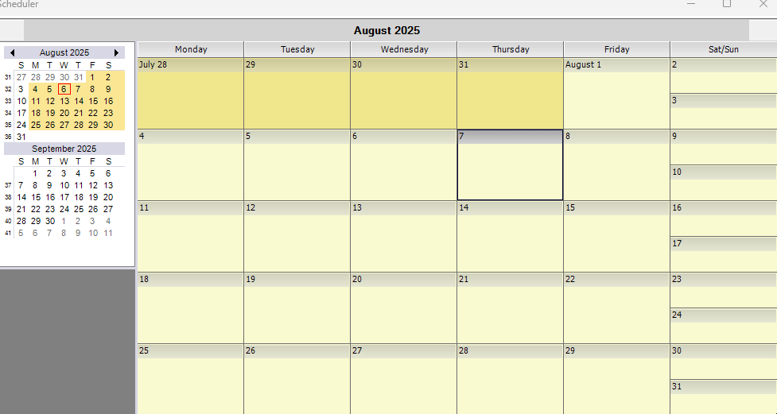

# How to add delete edit the appointments using custom appointment form in WinForms ScheduleControl?


Appointments in [WinForms ScheduleControl](https://www.syncfusion.com/winforms-ui-controls/scheduler) can be managed - added, edited, or deleted - by utilizing a custom appointment form. The custom appointment form is displayed through the [ShowingAppointmentForm](https://help.syncfusion.com/cr/windowsforms/Syncfusion.Windows.Forms.Schedule.ScheduleControl.html#Syncfusion_Windows_Forms_Schedule_ScheduleControl_ShowingAppointmentForm) event. The default appointment form can be suppressed by setting the `e.Cancel` property, and the custom form can be presented by invoking its `ShowDialog` method.

**Code for showing custom appointment form:**
 
 ```csharp
AppointmentForm form;
//Hook the event for showing the appointment form.
this.scheduleControl1.ShowingAppointmentForm += scheduleControl1_ShowingAppointmentForm;

/// <summary>
/// Raise the event when showing the appointment form
/// </summary>
void scheduleControl1_ShowingAppointmentForm(object sender, ShowingAppointFormEventArgs e)
{
    //Cancel the default appointment form for schedule control.
    e.Cancel = true;
    //Shows the Custom appointment form.
    form.ShowDialog();
} 
 ```

**Code for add or edit an appointment using the custom appointment form:**
 
 ```csharp
void OnAddorEditItem_Clicked(object sender, EventArgs e)
{
     IScheduleAppointment item;

     if (isEdit && currentAppointment != null)
     {
         //Update existing
         item = currentAppointment; 
     }
     else
     {
         //New
         item = dataProvider.NewScheduleAppointment(); 
     }

     if (item != null)
     {
         item.AllDay = true;
         item.StartTime = StartDateDateTimePickerAdv.Value;
         item.EndTime = EndDateDateTimePickerAdv.Value;
         item.Subject = SubjectTextBoxExt.Text;
         item.LabelValue = comboBox1.SelectedIndex;

         if (!isEdit)
         {
            dataProvider.AddItem(item);
         }             
     }
     schedulegrid.GetScheduleHost().SetDataToDayPanels();     
     this.Close();
} 
 ```

**Code for deleting appointment:**
 
 ```csharp
void OnDeleteItem_Clicked(object sender, EventArgs e)
 {
     //Remove the appointment
     scheduleProvider.RemoveItem(appointment);
     scheduleControl1.GetScheduleHost().SetDataToDayPanels();
 } 
 ```



Take a moment to peruse the [WinForms ScheduleControl - Getting Started](https://help.syncfusion.com/windowsforms/scheduler/getting-started) documentation, where you can find about getting started in ScheduleControl, with code examples.

